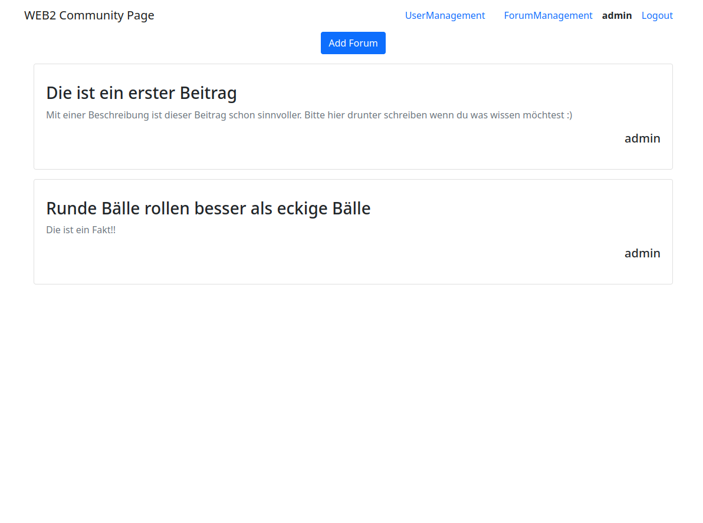

# Web Engineering II - Community Page

This is my first project with React. I worked on this project in the Semester 21/22.

This is supposed to be the frontend for a Community Page that uses MongoDB and Express -> https://github.com/georgno/we2-backend

This repo is just to have public proof of what I worked on.

# Setup

- change `changemeto.env` to `.env` and insert your url
- `npm start`